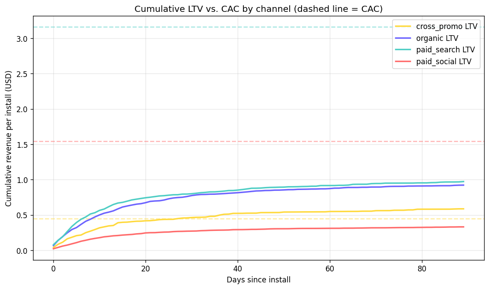
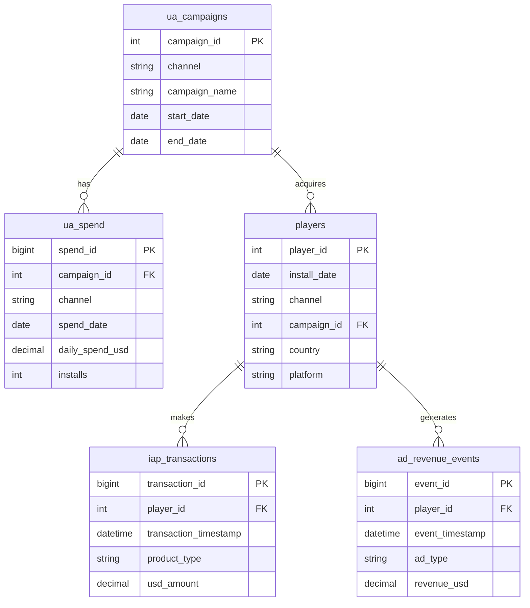

<div align="center">


<br/>


</div>

A portfolio project simulating a UA (user acquisition) budget review for a
mobile game: 90 days of spend across four channels, cohort-based LTV
tracking, and a quantified budget reallocation recommendation — the kind
of financial/growth analysis a live-ops or marketing analytics team runs
every month.

**Built to demonstrate the financial half of mobile game analytics** —
CAC, LTV, ROAS, and payback period — that pairs with product-side work
like A/B testing and retention analysis (see the companion
[Bingo F2P Analytics](../bingo_analytics) project).

---

## 🔑 Headline finding

`paid_social` has the **lowest** cost-per-install of the three paid
channels — but the **worst** return. `cross_promo`, the smallest spend
line in the portfolio, is the only paid channel that actually pays back
within 90 days, at 130% ROAS.

<div align="center">

| Channel | Blended CAC | D90 LTV | D90 ROAS | Payback |
|:---:|:---:|:---:|:---:|:---:|
| 🟢 **cross_promo** | $0.45 | $0.59 | **130.3%** | Day 28 |
| ⚪ organic | $0.00 | $0.92 | — | Immediate |
| 🟡 paid_search | $3.16 | $0.97 | 30.8% | Not in 90d |
| 🔴 **paid_social** | $1.54 | $0.33 | 21.5% | Not in 90d |

</div>

> 💡 **CPI alone ranks these channels almost exactly backwards from what
> the LTV data supports.** paid_social absorbs the largest budget share
> while returning the least.

📄 Full stakeholder readout: [`docs/stakeholder_writeup.md`](docs/stakeholder_writeup.md)

<div align="center">

</div>

---

## 📑 Table of contents

- [Project structure](#-project-structure)
- [Data model](#️-data-model)
- [What each notebook covers](#-what-each-notebook-covers)
- [Analysis workflow](#-analysis-workflow)
- [Running it locally](#-running-it-locally)
- [Stack](#️-stack)

---

## 📊 Project structure

```
ua_ltv_analytics/
├── generate_data.py              # synthetic UA spend + player + revenue generator
├── sql/
│   ├── schema.sql                # table definitions
│   └── analysis_queries.sql      # 20 business-focused MySQL queries
├── data/                         # generated CSVs (gitignored — run generator locally)
├── notebooks/
│   ├── 01_ua_spend_exploration.ipynb    # spend, blended vs. marginal CPI trend
│   └── 02_ltv_roas_payback.ipynb        # LTV curves, ROAS, payback, reallocation model
├── docs/
│   └── stakeholder_writeup.md    # one-page finance-facing readout
└── requirements.txt
```

## 🗂️ Data model



---

## 🔄 Analysis workflow


---

## 🔍 What each notebook covers

<details open>
<summary><b>📓 01 — UA Spend Exploration & CAC</b></summary>
<br/>

- Total spend, installs, and blended CAC by channel
- Daily CPI trend, 7-day rolling average
- **First-30-days vs. last-30-days CAC comparison** — catches `paid_social`'s
  marginal cost nearly doubling over the window, a fact the blended average
  hides completely.

</details>

<details>
<summary><b>📓 02 — LTV, ROAS & Payback Period</b> (the core deliverable)</summary>
<br/>

- Combines IAP + ad revenue into a single per-player LTV timeline
- Cumulative LTV curves vs. CAC, by channel, over a 90-day window
- Payback day calculation (first day cumulative LTV crosses CAC)
- D90 ROAS by channel
- A quantified budget reallocation model — dollars and installs, not just
  a verbal recommendation

</details>

---

## 🚀 Running it locally

```bash
pip install -r requirements.txt
python generate_data.py          # generates data/*.csv (~30 sec)
jupyter notebook notebooks/       # run 01 → 02, in order
```

---

## 🛠️ Stack

<div align="center">


</div>

Financial/growth methods: blended vs. marginal CAC, cohort-based LTV,
payback period, ROAS, quantified budget reallocation modeling.

<div align="center">
<br/>

</div>
